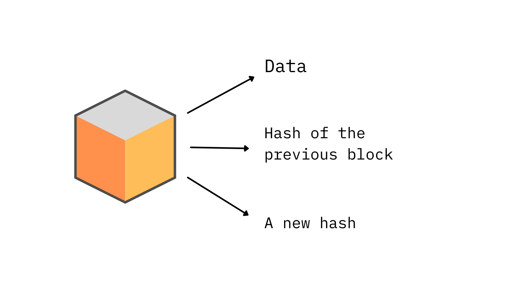
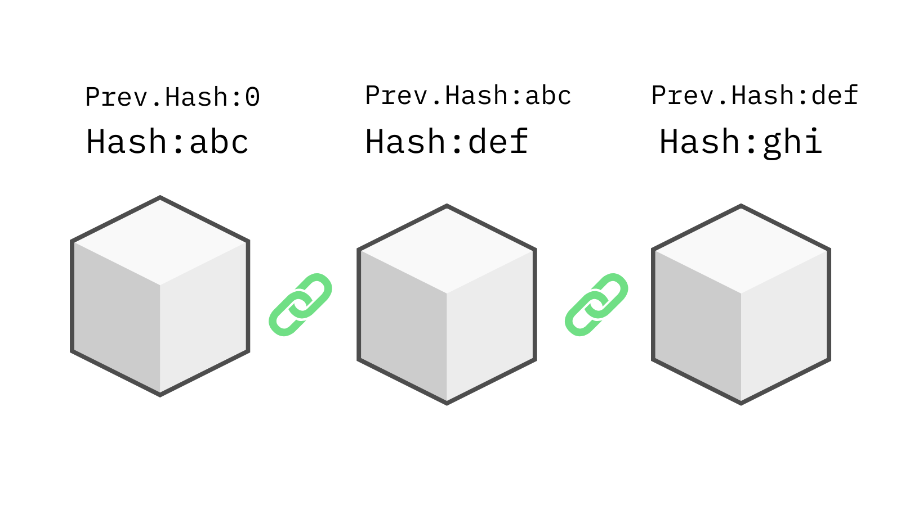
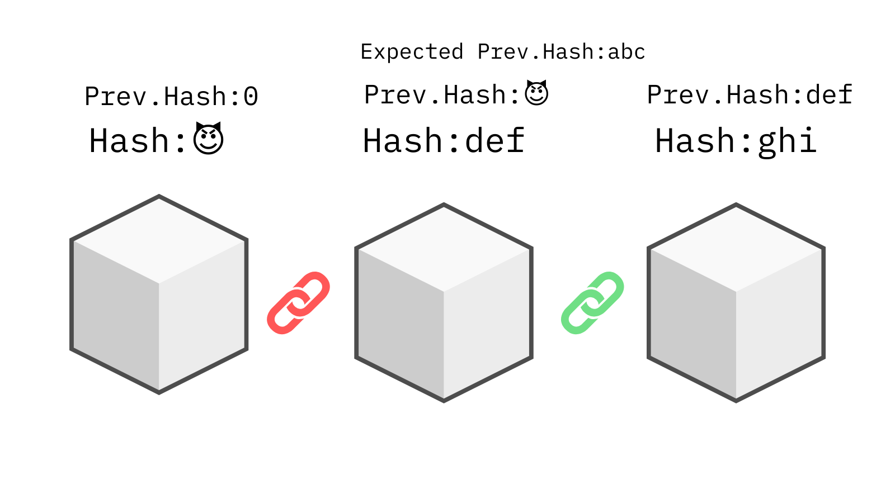
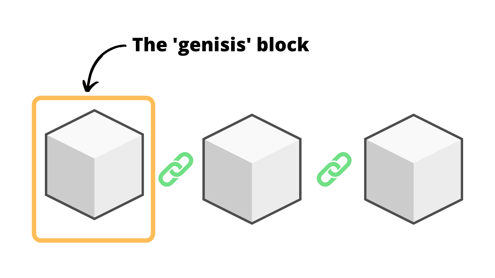
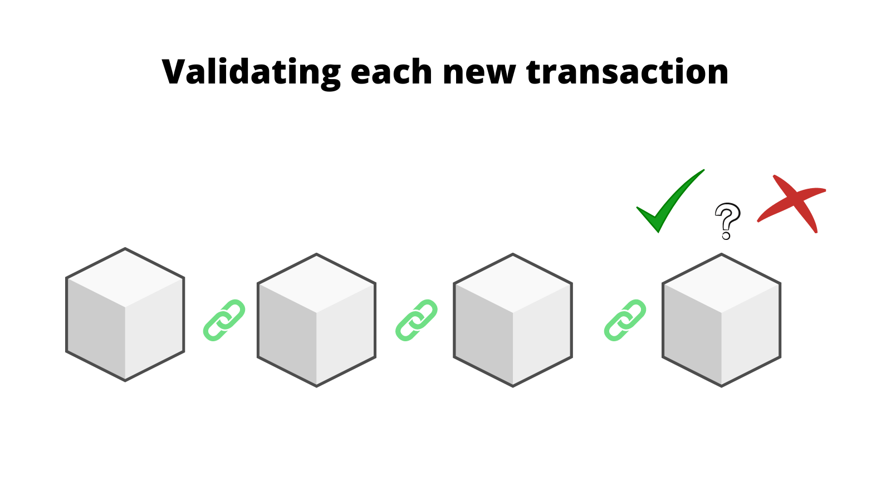

import { ArticleLayout } from '@/components/ArticleLayout'

export const meta = {
  author: 'Pratham Prasoon',
  date: '2022-03-14',
  title: 'The anatomy of a blockchain',
  description:
    'Learn how a blockchain works from the ground up.',
}

export default (props) => <ArticleLayout meta={meta} {...props} />

### Introduction

**Blockchain**, it's the technology behind cryptocurrencies like bitcoin and ethereum which hold ~$1,700,000,000,000 in value.

A technology that according to some is not only changing the way we do finance but also shaping the next generation of the internet, web3.

But even does a **blockchain** even mean? How does it work? 🤔

You're at the right place! In this post we'll gain a in depth understanding about it.
This is the anatomy of a blockchain 🔗

> **Note:** There are 2 main types of blockchains, _permissioned_ and _un-permissioned_. For the purposes of this post, we'll only be focusing on the <mark>un-permissioned blockchains.</mark>

### Definition

First of all, what is a blockchain?

The blockchain is a (A) decentralised, (B) immutable, (C) verifiable and (D) public ledger(list) of transactions.

Let's break this down.

The blockchain is basically a list of transactions that is...

- (A) Distributed 🏦: Not owned or controlled by a central authority and is distrubuted amongst several nodes.

- (B) Immutable 🔐: Transactions on the blockchain cannot be changed once they've gone through.

- (C) Verifiable ✅: Each and every transaction on the blockchain can be verified by anyone.

- (D) Public 👪: The transactions on the blockchain can viewed by anyone.

In more simple terms, a blockchain keeps track of transactions that take place on a network in an open and secure manner.

As the name suggests, the blockchain is a chain of 'blocks' connected to each other.

The blocks are individual transactions that place on the network.

### The building blocks

Each block has three pieces of information in it.

- Some Data
- The 'hash' of the previous block
- A new 'hash' for the current block

In the case of a blockchain like bitcoin, this data cointains information of the sender, recipient and amount of money of transferred.

> The 'hash' is essentially a long string of characters (numbers and alphabets)

Each hash of a block is connected to the block before it.

It is because of this property that all blocks in the blockchain are connected to one another.

A chain of blocks makes a — **blockchain** 🔗

### Security

Tampering with the hash of any one block will break the hashes between the blocks, hence making the entire chain invalid ❌

The hash of a block is uniquely paired to the hash on the next block, changing one hash changes the hash of the next block.

### The Genisis

Another thing to keep in mind is that the very first block on the blockchain has no blocks before it, there exists no previous hash.

This block is called the **genisis** block — the place where blockchain is born.

### Consensus

#### The problem

In order to change one transaction, you'd have to recalculate and make sure the hashes of all the other blocks match on the chain. This is computationally intensive, however not impossible to achieve.

A modern computer could change the hash of a block and then figure out the corresponding hashes of the other blocks, making the blockchain valid and sucessfully tampering with a transaction.
Which as you might have figured, is a big problem.

#### The solution

In order the combat this, blockchains use some called a consensus protocol. Remember how I mentioned the blockchain is a distributed amongst several nodes?

This protocol is keeps the blockchain in a working condition, making sure each new block added to the chain is valid.

It ensures all nodes are in agreement that the transactions that have taken place.

Different blockchains use different consensus protocols, bitcoin uses something called "Proof of Work", Solana operates on "Proof of History" and so on.

It is because of this consensus protocol that if you were trying to create a fradulent transaction on the blockchain, you'd have to have to control a huge number of the nodes which is (mostly) impossible.

This makes the blockchain secure and immutable.

### Conclusion

In this blog post we mainly learnt about 👇

- Some of the important properties of a blockchain
- What is a blockchain made up of?
- How does a blockchain validate transactions?

All this information gives us a good fundamental understanding of how a blockchain works.
