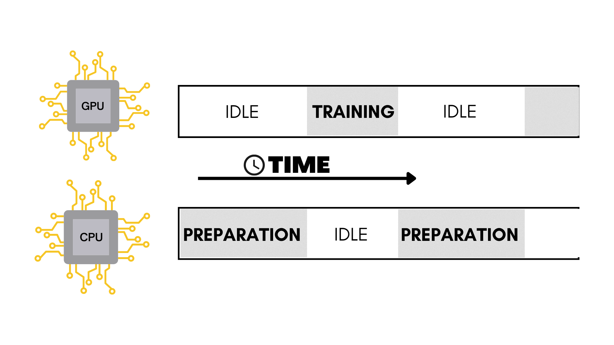
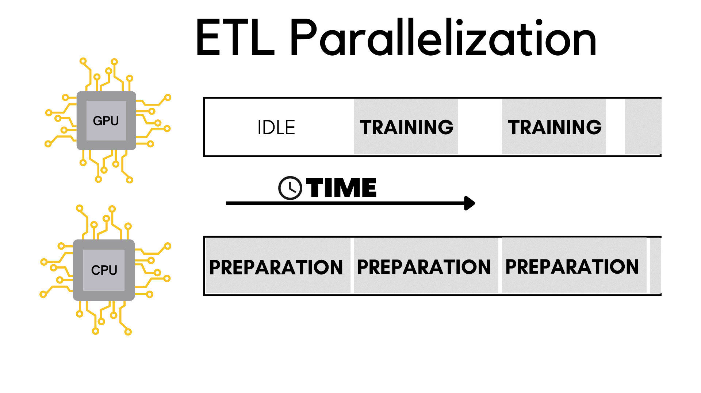

### Introduction

Google spent $36,847 an hour in computational power for 40 days straight to train a machine learning model called AlphaGo.

Put simply, making these models is an expensive and lengthy process. 

Here's how you can potentially train your models upto 2x faster with the magic of parallelization.

### A typical machine learning pipeline

Training a machine learning model is typically a 3 step process called 'ETL', which stands for:

- Extraction 
- Transformation 
- Loading

Let's take a closer look at these phases.

#### Extraction

This is start of the machine learning pipeline where the raw data is extracted from wherever it is stored.

This data needs to be processed before it is fed into the model.

#### Transformation

During this phase the extracted data is transformed and manipulated according to our needs.

This can include things like data augmentation, resizing, normalization etc.

#### Loading

Now that we've extracted and transformed the data, it is ready to be fed to the model!

As the name suggests, during this phase the data is loaded for training on the neural network.

### ETL in code
Here's some tensorflow code showing these ETL phases.

```py
# Importing the libraries
import tensorflow as tf
import tensorflow_datasets as tdfs
import tensorflow_addons as tfa
from tensorflow.keras.optimizers import RMSprop
from tensorflow.keras import layers, Model, Input

# Model definition
input_layer = Input(shape=(100, 100, 3), name="img")
x = layers.Conv2D(16, (3, 3), activation='relu')(input_layer)
x = layers.MaxPooling2D(2, 2)(x)
x = layers.Conv2D(32,(3,3), activation="relu")(x)
x = layers.MaxPooling2D(2, 2)(x)
x = layers.Conv2D(64,(3,3), activation="relu")(x)
x = layers.MaxPooling2D(2, 2)(x)
x = layers.Conv2D(64,(3,3), activation="relu")(x)
x = layers.MaxPooling2D(2, 2)(x)
x = layers.Conv2D(64,(3,3), activation="relu")(x)
x = layers.MaxPooling2D(2, 2)(x)
x = layers.Flatten()(x)
x = layers.Dense(512, activation="relu")(x)
output_layer = layers.Dense(1, activation="sigmoid")(x)

model = Model(input_layer, output_layer, name="CNN")
model.compile(optimizer=RMSprop(learning_rate=0.0001), loss='binary_crossentropy', metrics=['accuracy'])
model.summary()

# EXTRACTION PHASE
data = tdfs.load("malaria", split='train', as_supervised=True)
# EXTRACTION PHASE END

# TRANSFORMATION PHASE
def augmentation(image, label):
    image = tf.cast(image, tf.float32)
    image = tf.image.resize(image, (100, 100))
    image = image / 255
    image = tf.image.random_flip_left_right(image)
    image = tfa.image.rotate(image, 40, interpolation='NEAREST')
    image = tf.image.random_brightness(image, 0.1)
    image = tf.image.random_contrast(image, 0.8, 1.2)
    return image, label

train = data.map(augmentation)
train_batches = train.shuffle(100).batch(32)
# TRANSFORMATION PHASE END

# LOAD PHASE
history = model.fit(
    train_batches,
    epochs=15
)
# LOAD PHASE END
```

Essentially what happens here in this code is that:

A. The extraction and transformation steps take place on the CPU, which loads and transforms the data in batches.

B. Then that processed batch of data is loaded onto the GPU for training.


When training a machine learning model, we usually never load the entire data into the model because we have limited memory to work with.

> The CPU prepares batches of data and then sends them to the GPU one by one to train the model.

### The problem

The problem that arises here is that when the CPU is and transforming the data for a particular batch, the GPU is basically sitting there doing absolutely nothing.

Vice versa, the CPU is idle when the GPU is training. 

As we can see this is clearly very inefficient.



What if there was a way to make the CPU prepare the next batch of data while the GPU trains on the current one?

### ETL parallelization

Say hello to ETL parallelization! 👋 



The idea here is that while the GPU gets trained on a batch of data, the CPU can simultaneously prepare the next batch to be fed in.

It is only for the very first iteration that the GPU has to be idle waiting for the CPU to extract and load the data.

#### The tweaked code

```py
# Importing the libraries
import tensorflow as tf
import tensorflow_datasets as tdfs
import tensorflow_addons as tfa
from tensorflow.keras.optimizers import RMSprop
from tensorflow.keras import layers, Model, Input

# Model definition
input_layer = Input(shape=(100, 100, 3), name="img")
x = layers.Conv2D(16, (3, 3), activation='relu')(input_layer)
x = layers.MaxPooling2D(2, 2)(x)
x = layers.Conv2D(32,(3,3), activation="relu")(x)
x = layers.MaxPooling2D(2, 2)(x)
x = layers.Conv2D(64,(3,3), activation="relu")(x)
x = layers.MaxPooling2D(2, 2)(x)
x = layers.Conv2D(64,(3,3), activation="relu")(x)
x = layers.MaxPooling2D(2, 2)(x)
x = layers.Conv2D(64,(3,3), activation="relu")(x)
x = layers.MaxPooling2D(2, 2)(x)
x = layers.Flatten()(x)
x = layers.Dense(512, activation="relu")(x)
output_layer = layers.Dense(1, activation="sigmoid")(x)

model = Model(input_layer, output_layer, name="CNN")
model.compile(optimizer=RMSprop(learning_rate=0.0001), loss='binary_crossentropy', metrics=['accuracy'])
model.summary()

# EXTRACTION PHASE
data = tdfs.load("malaria", split='train', as_supervised=True)

# Reading the saved files with the raw data
file_pattern = f'~/tensorflow_datasets/malaria/1.0.0/malaria-train.tfrecord*'
file = tf.data.Dataset.list_files(file_pattern)

# Using the interleave function to concurrently load the files
train_dataset = file.interleave(
    tf.data.TFRecordDataset,
    cycle_length=4, # Number of files to read in parallel
    num_parallel_calls=tf.data.experimental.AUTOTUNE # Number of CPU threads to use for parallel processing
)
# EXTRACTION PHASE END

# TRANSFORMATION PHASE
def augmentationV2(serialized_data):
    description ={
        'image': tf.io.FixedLenFeature((), tf.string),
        'label': tf.io.FixedLenFeature((), tf.int64, -1)
    }
    example = tf.io.parse_single_example(serialized_data, description)
    image = tf.image.decode_jpeg(example['image'], channels=3)
    image = tf.cast(image, tf.float32)
    image = tf.image.resize(image, (100, 100))
    image = image / 255
    image = tf.image.random_flip_left_right(image)
    image = tfa.image.rotate(image, 40, interpolation='NEAREST')
    image = tf.image.random_brightness(image, 0.1)
    image = tf.image.random_contrast(image, 0.8, 1.2)
    return image, example['label']

import multiprocessing
# Number of CPU cores available
cores = multiprocessing.cpu_count()

# Using the map function to apply the augmentation function to the dataset in parallel on the CPU cores
train_dataset = train_dataset.map(augmentationV2, num_parallel_calls=cores)

# Cache the dataset to memory to avoid reading from disk every epoch
train_dataset = train_dataset.cache()

train_dataset = train_dataset.shuffle(100).batch(32)
# Prefetching the data to improve the speed of the training
train_dataset = train_dataset.prefetch(tf.data.experimental.AUTOTUNE)
# TRANSROFMATION PHASE END

# LOAD PHASE
history = model.fit(
    train_dataset,
    epochs=15
)
# LOAD PHASE END
```

### The results

Running both these models for 15 epochs on my M1 Macbook pro took about 6 minutes on the regular model and 3 minutes on ETL optimised variant.

We've roughly halved the training time, sweet!
