Ever wondered why it is so hard to solve a Rubik's cube? This blog post is attempt to answer exactly that.

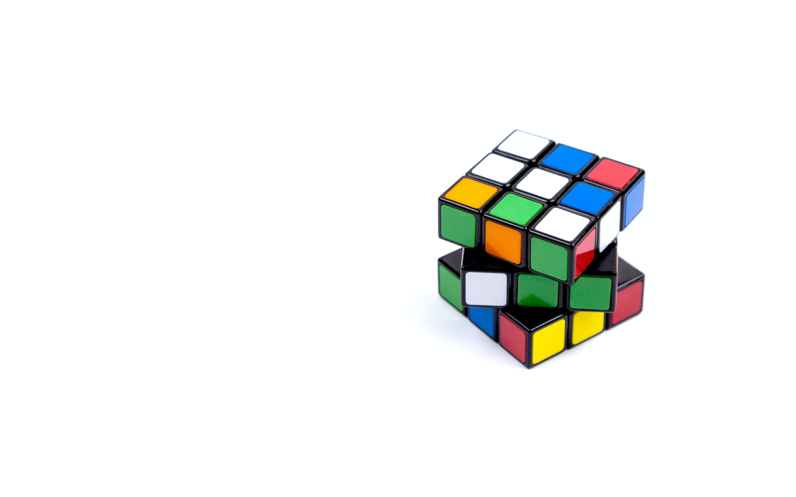

### Introduction

Put simply the rubik's cube can be scrambled in many **many** ways.

**43,252,003,274,489,856,000** ways to be precise.

Just to give you an idea of how big of a number we're dealing with 43,252,003,274,489,856,000 is read as 43 quintillion, 252 quadrillion, 3 trillion, 274 billion, 489 million and 856 thousand.

That number is more than the amount of sand grains on our plant, which is insane!

### The basics
But before we get to that huge number, let's first start with with something much more simple and we'll make our way up.

We have 2 balls, one orange and the other blue.

> In how many ways can we arrange them side by side?

There are 2 cases here. 

- Case 1 : Orange on the right and blue on the right 
- Case 2 : Blue on the left and orange on the right 

Pretty simple right?

Now how many cases do you think we'll have for 3 balls?

Try using a piece of paper to find out.

There are 6 cases here, as you can see below.

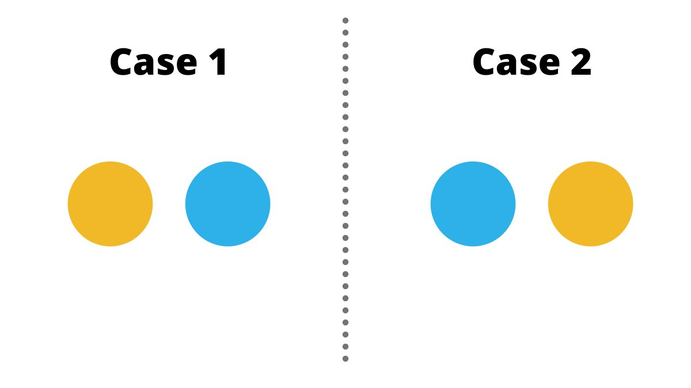

### Taking it up a notch

Now how many cases do you think we'll have for 3 balls?

Try using a piece of paper to find out.

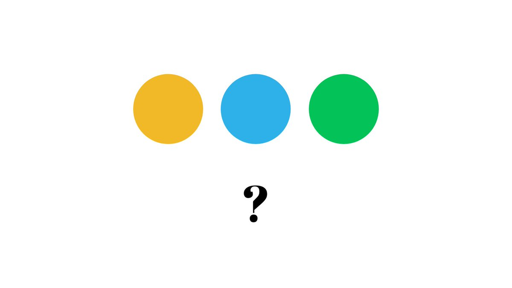

There are 6 cases here, as you can see below.

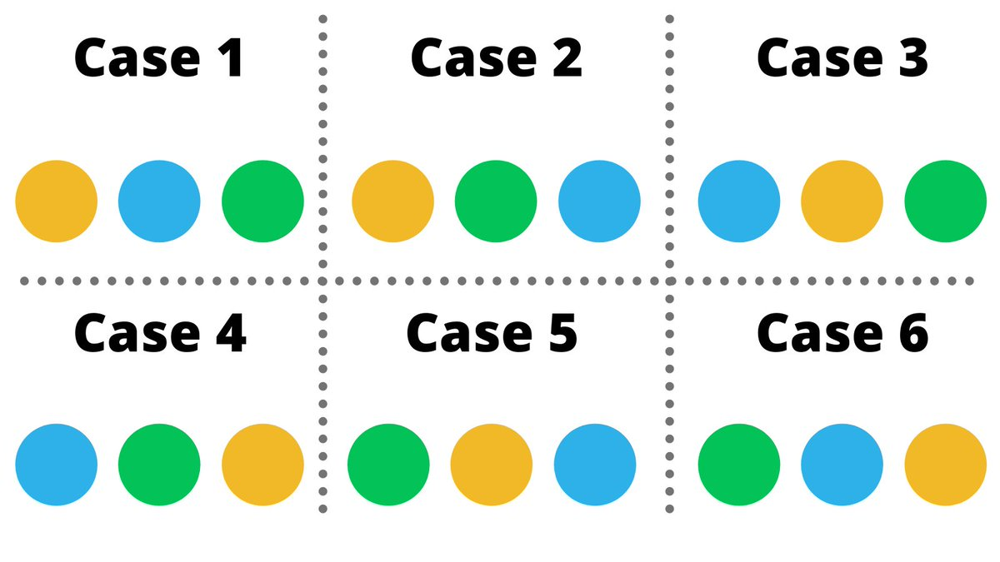

Now you can repeat this process for 4,5... different balls and you'll notice a neat pattern here.

The number of cases is equal to the number of balls multiplied by the number before it until you reach 1, this is called a factorial.

Like, **3!**  = 3 x 2 x1
(Read as 3 'factorial')

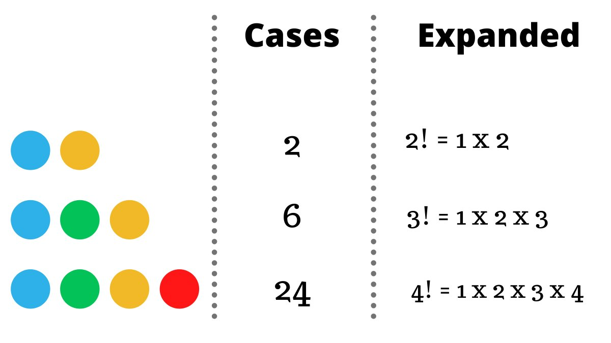

🤔 Another way of thinking about arranging 4 different balls is having 4 blank spaces where we put them.

In the first one we can have any of the 4 balls, but in the second one we can put 3 because we've already used one before, then 2 and 1,multiplying them gives us the answer.

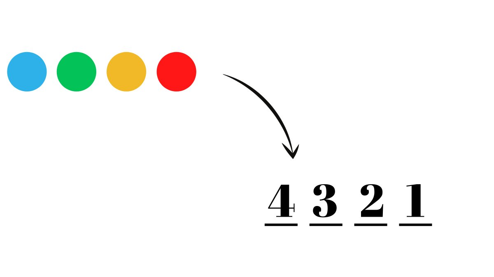

Now let's take a look at another interesting problem, let's say we have 4 balls and we want to pick 2 out of them.

How many cases are there here?

> Hint: Use the previous method

Here's a brute force method of simply listing down all the possible cases, which totals to 12.

Another way of thinking about this would be that we 2 blank spots to fill, in the first one we can have any of the 4 balls and then 3 in the next = 4 x 3 = 12 cases

### Permutations

These number of 'cases' are also called 'permutations', essentially in how many ways can some number of things be arranged.

A generalised formula for finding the number of permutations which is given below 👇🏻 

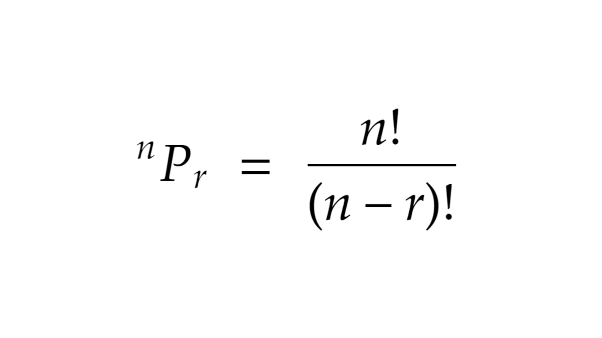

We can essentially compare this to the example we used before:

In how ways out of 4 balls can we pick 2? or ⁴P₂ (read as 4 permute 2).

Plugging these values in the formula will give you 12, so we know it works.

Another thing that's similar to 'permutations' that we should know about is 'combinations'.

### Combinations

Combinations are essentially permutations but the order does not matter, let me show you what I mean by that.

In the example where we took 2 out of 4 balls, we had 12 permutations.

Notice the 2 permutations in the red boxes, both of them have the same color of balls except the order is different.

When we're counting the number of 'combinations' we don't look at the order and both these are counted as 1.

Therefore, we have 6 combinations in this example.

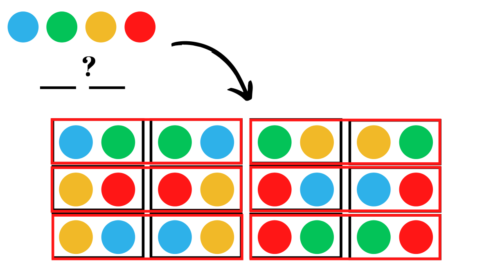

Here's the general formula for the number of combinations.

Notice how its the same as permutations except the r! in the denominator

To remove different arrangements of the same r objects we divide by the number of arrangements of each one i.e. r!

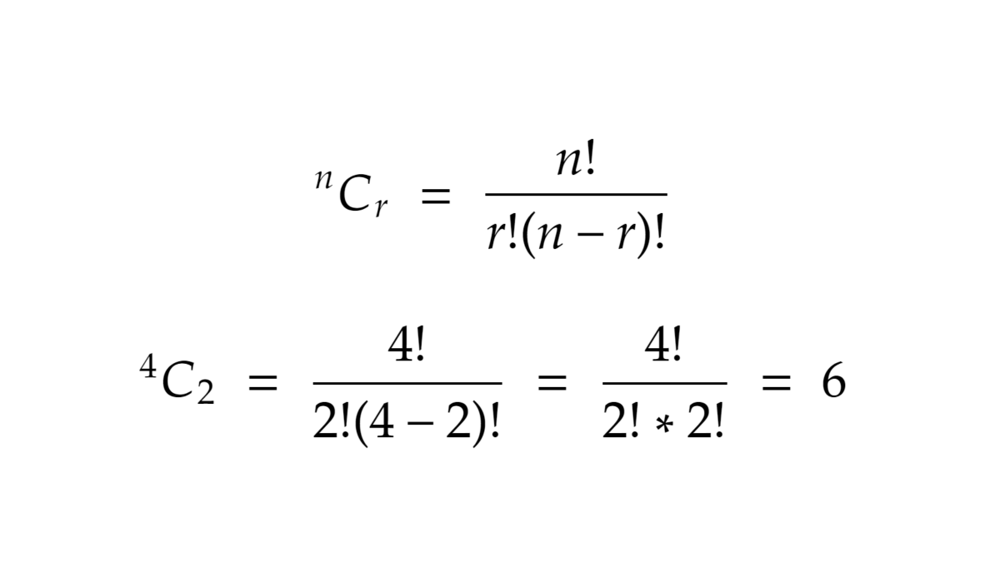

### Breaking the cube down

Now back to the original question, why can the Rubik's cube be scrambled in 43,252,003,274,489,856,000 ways?

For that we have to understand the anatomy of a cube.

We have 3 types of pieces here:
- The core (1)
- Edges (12)
- Corners (8)

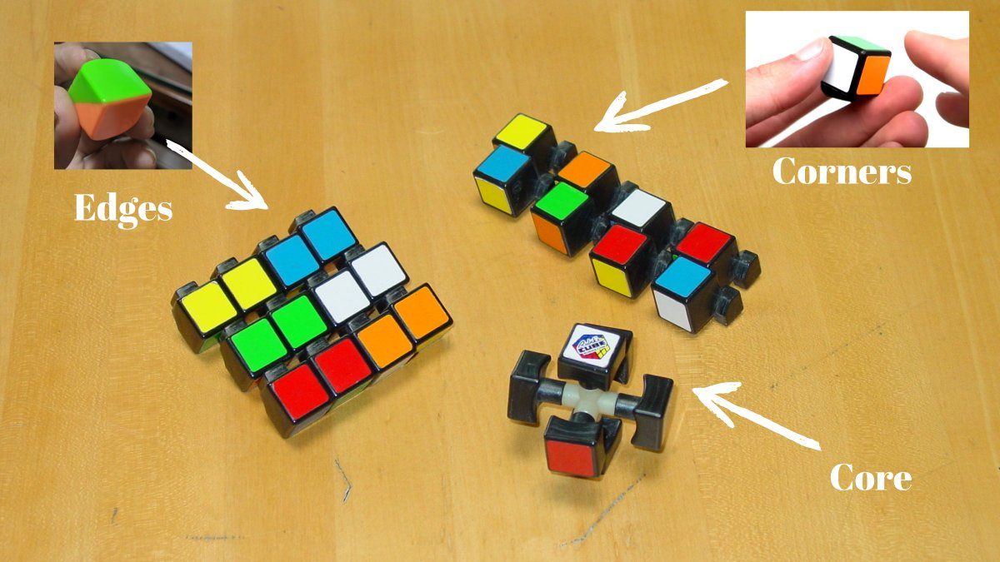

When you move a rubiks cube, only the edges and corners move while the core stays stationary.

They will determine the number of ways in which we can scramble a rubiks cube.

Let's start with the edge pieces 👇🏻

#### Edge pieces

We have 12 edge pieces and these can go in 12 different places, which means the number of permutations with be 12 for the first blank, 11 in the other... multiplied until we reach 1.

Which we know from the previous examples, this comes out to be 12!

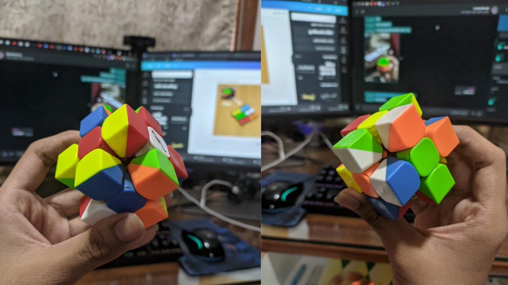

#### Corner pieces
Similarly we have 8 corner pieces, that can be in 8 places which equals to 8! cases.

The number of ways we can simply arrange the corners and edge pieces is 8! x 12! 

Now, each edge piece can be oriented in 2 ways and a corner piece in 3.

To account for this we have 2x2... 12 times = 2¹² (for each edge) orientations, along with  3x3... 8 times = 3⁸ (for each corner).

### Putting it all together
Multiplying it all together we get 8! x 12! x 3⁸ x 2¹² ways to assemble the pieces of a rubiks cube, not scramble (an important distinction!)

When you calculute 8! x 12! x 3⁸ x 2¹² you'll get 519,024,039,293,878,272,000, which is an even larger number than 43 quintillion.

### The problem(?)
While this answer isn't wrong, it tells us the number of ways we can assemble a rubiks cube in, but not scramble it.

Here's are the thing certain positions of a rubiks cube are impossible to solve when you assemble it, this is called a 'parity'.

Parity cases include:
- only edge being flipped
- only one corner being flipped
- only 2 edges swapped
- only 2 corners swapped

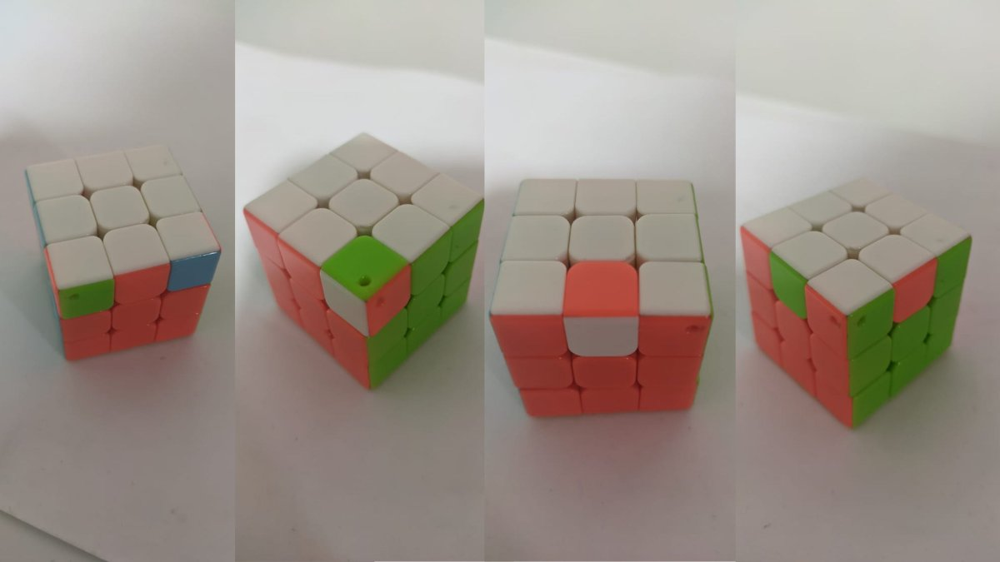

### Removing the parities

These cases simply do not happen when your cube is scrambled and not disassembled, hence have to divide away these cases from our previous result.

What we're essentially doing here is removing the 'unsolvable' cases.

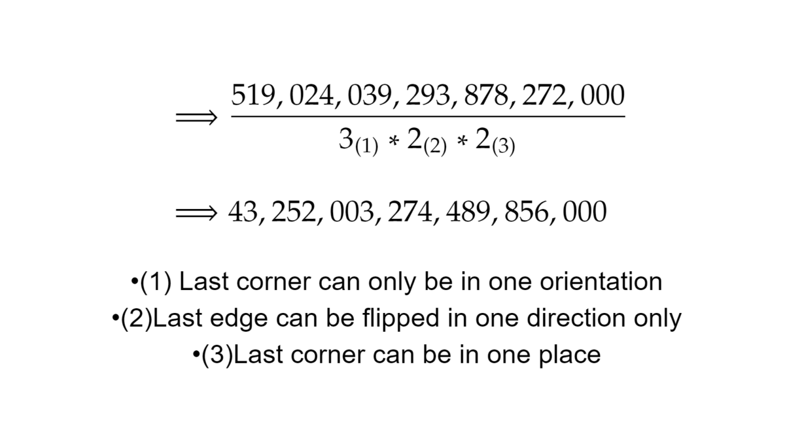

That finally brings us to where we started, why a Rubik's cube can be scrambled in 43,252,003,274,489,856,000 ways and in this journey you learned about combinatorics!

A sub field of math dedicated to counting using permutations and combinations.
