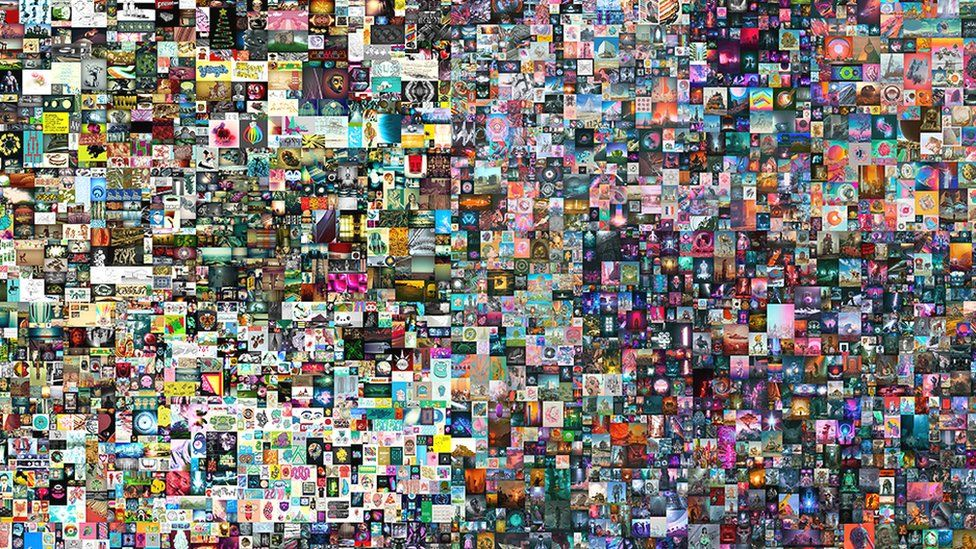
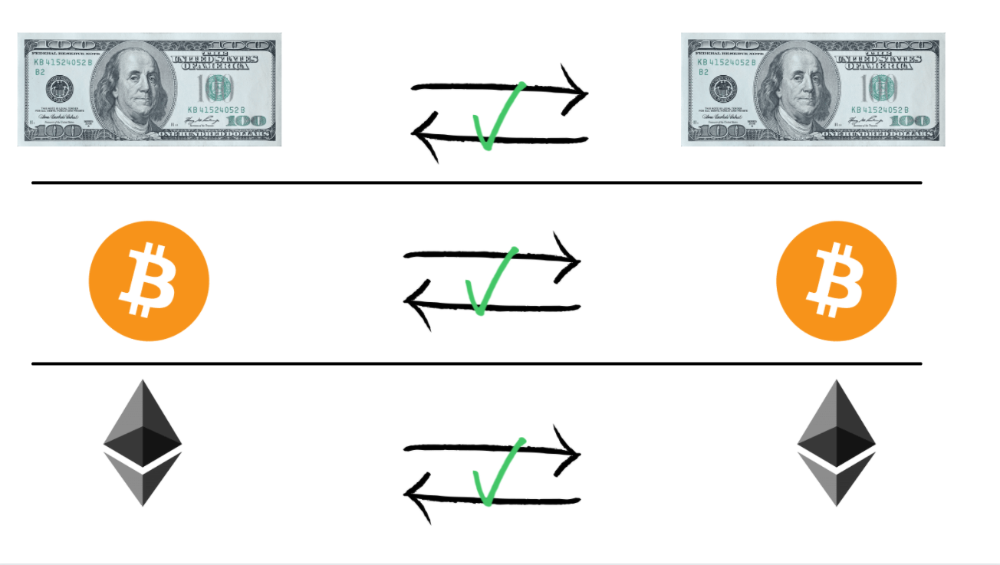
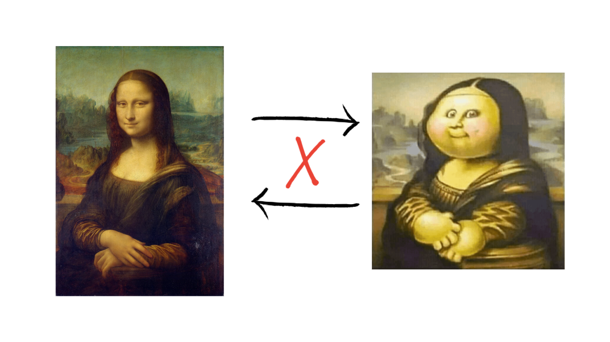
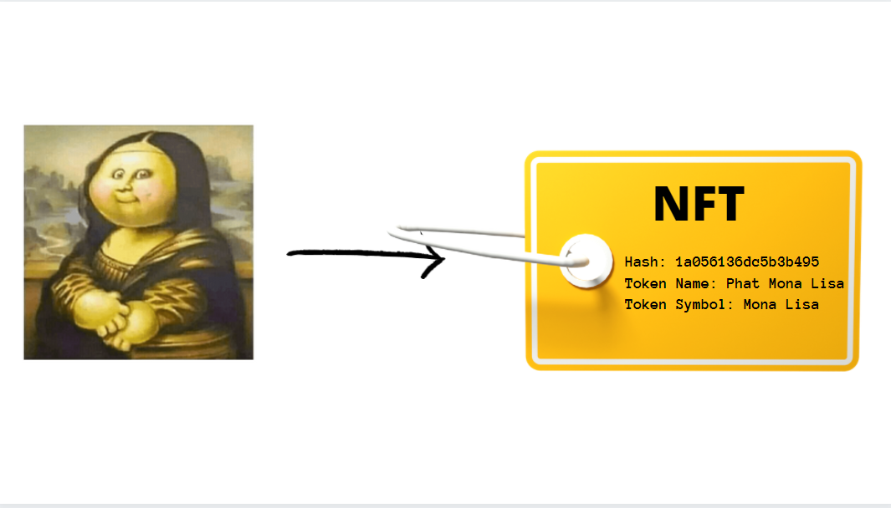
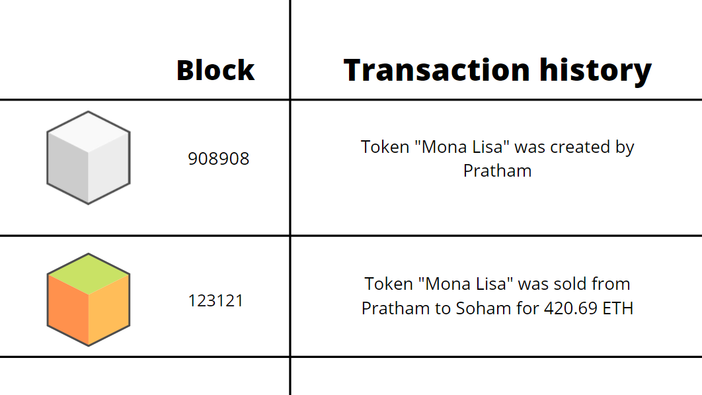

### Introduction

This image sold for $69.3 million as an <mark>**Non Fungible Token** short for **NFT**</mark>, one of the most fascinating applications of blockchains.



You must've already heard about it but do you know how they really work?

That is exactly what we'll discuss in this blog post.

### Fungible?

When we say something is fungible, that means that it can replaced by something that is exactly the same value. 

For example you can you take a 100 dollar bill and another one, they have the same value and are interchangable.



There's nothing unique about a specific 100 dollar bill, probably millions of them are in circulation.

### Non-Fungible Tokens

When we say something is _non-fungible_ it means that it is unique and cannot be exchanged for something else.

You cannot exchange the Mona Lisa for something else. 



Non fungible tokens are the same thing but are digital tokens on the blockchain that represent ownership of a digital file.

Let me explain.

### Showing ownership

Let's say I am a digital artist who made this art and I want to sell it to someone so that they can be its owner.

Since this is a literally a JPEG file that anyone can download, it is hard to show who owns it.


You can associate the file to a particular wallet on the blockchain, this is called "minting" an NFT.

Here's how its done 👇🏻 

### Minting the NFT

##### 1️⃣ Hash of the file

This basically a unique representation of the file in some characters, whether you rename the file, or copy it that hash remains the same. 

If you're curious, open a terminal and try looking for hashes of a file. No two different files can have the same hash.

```bash
# Windows
Certutil -hashfile <path to file> MD5

#Linux/MacOS
md5sum <path to file>
```

##### 2️⃣ Adding more details

More details like the name of this token and the token symbol are added, boom the token is created.



##### 3️⃣ Putting it on the blockchain

This token with hash and all other details are put up on a blockchain and now the ownership of it can be transferred to any other account just like how normal crytocurrencies work.



Since this is all on the blockchain the NFT is 👇

- **Immutable**: Cannot be changed.
- **Distributed**: Cannot be tampered with.
- **Transparency**: All transactions are visible on the blockchain.

If you think about it, an NFT is really just like any crytocurrency, except there's only one piece of that currency. 

But this is where things get a bit weird.

### The caveats
While the owner of the NFT has _ownership_ of the file, anyone can freely view and download the exact same file.

The owner also does NOT have any copyrights to the file, all of that stays with the orignal creator. They can choose to do whatever they want with it.

All the owner has is some sort of online bragging rights, like "Hey I _own_ this image!".

#### Gas

Also, in order to mint and NFT you have to pay something called "gas" fees to the miners in the network.

This is because all the nodes of the blockchain are keeping track of all the transactions which requires some computational cost, hence they're rewarded for it.

People collect playing cards, watches and paintings, who's very similar clones could be made but there is that authenticity in the orignal one.

Similarly anyone can download a file but the minted NFT file is unique.

But NFTs aren't limited to just esoteric jpeg art...


### The potential
There are some more interesting practical use cases for these tokens in the future. 

Imagine minting NFTs for ownership of:

- 🌐 Domain names
- 👨‍👧‍👦 Access to special events
- 🎮 In-game customisations (skins, upgrades etc)
- 🎟️ Movie tickets 
- 🏡 Real estate

and more...

However just like any new and bleeding edge technology, there are very few practical use cases of NFTs right now. 